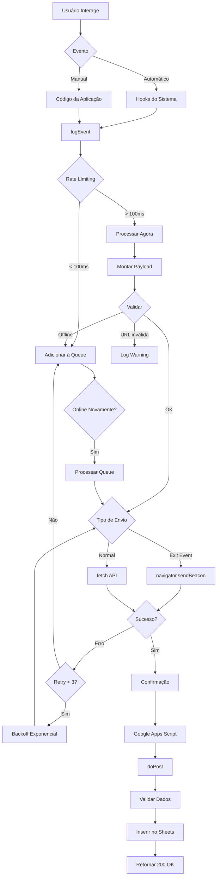

# 📦 Documentação Detalhada do Payload - Sistema de Telemetria BitLab

## 📋 Índice
1. [O que é o Payload?](#o-que-é-o-payload)
2. [Estrutura Completa do Payload](#estrutura-completa-do-payload)
3. [Campos Detalhados](#campos-detalhados)
4. [Quando e Como os Dados São Capturados](#quando-e-como-os-dados-são-capturados)
5. [Fluxo de Dados Completo](#fluxo-de-dados-completo)
6. [Tipos de Eventos e Suas Variações](#tipos-de-eventos-e-suas-variações)
7. [Interpretação de Dados para Pesquisa](#interpretação-de-dados-para-pesquisa)

---

## 🎯 O que é o Payload?

O **payload** é o pacote de dados estruturados que o sistema de telemetria envia automaticamente para o Google Sheets sempre que um evento ocorre no BitLab. Pense nele como um "envelope digital" contendo todas as informações sobre a ação que o estudante realizou.

### Características Principais:
- ☁️ **Automático e invisível**: Enviado sem interferir na experiência do usuário
- 🔒 **Anônimo e ético**: Sem dados pessoais identificáveis (GDPR compliant)
- 📊 **Estruturado**: Formato consistente para análise estatística
- ⚡ **Tempo real**: Dados chegam imediatamente ao Google Sheets
- 🔄 **Resiliente**: Sistema de retry e offline queue para garantir entrega

---

## 📐 Estrutura Completa do Payload

Cada evento enviado contém **12 campos principais** organizados da seguinte forma:

```javascript
{
  // === IDENTIFICAÇÃO DE TEMPO ===
  timestamp: "2026-02-25T14:30:15.234Z",  // ISO 8601 format
  
  // === IDENTIFICAÇÃO DA SESSÃO/USUÁRIO ===
  sessionId: "session_f4k8x2p1q",         // ID único da sessão atual
  studentId: "student_anonymous_hash",     // ID anônimo do estudante
  
  // === CATEGORIZAÇÃO DO EVENTO ===
  topic: "QUIZ",                           // Categoria macro do evento
  metricType: "QUIZ_ATTEMPT",              // Tipo específico do evento
  value: "correct|incorrect|numeric",      // Valor/resultado do evento
  
  // === CONTEXTO DA INTERAÇÃO ===
  userJourney: "[{objeto},{objeto}]",     // Histórico de navegação (JSON)
  additionalData: "{json_object}",        // Dados específicos do evento (JSON)
  
  // === INFORMAÇÕES TÉCNICAS ===
  userAgent: "Mozilla/5.0...",            // Browser e dispositivo
  viewport: "1920x1080",                  // Resolução da tela
  language: "pt-BR",                      // Idioma do navegador
  platform: "Win32",                      // Sistema operacional
  
  // === CONTROLE DE ENVIO ===
  isRepeating: "true|false",              // Se é estudante repetente
  retryCount: 0                           // Número de tentativas de envio
}
```

---

## 🔍 Campos Detalhados

### 1. `timestamp` - Carimbo de Tempo
**Tipo**: String (ISO 8601)  
**Exemplo**: `"2026-02-25T14:30:15.234Z"`

**Pega quando**: No momento exato que o evento ocorre  
**Como é gerado**: `new Date(now).toISOString()`

**Interpretação**:
- Formato universal, independente do fuso horário
- Precisão de milissegundos
- Use para calcular: duração de sessão, tempo entre eventos, padrões temporais
- **Análise**: Agrupe por hora/dia/semana para identificar picos de uso

```javascript
// Exemplo de uso em análise:
const evento1 = new Date("2026-02-25T14:30:15.234Z");
const evento2 = new Date("2026-02-25T14:32:45.123Z");
const duracaoSegundos = (evento2 - evento1) / 1000; // 149.889 segundos
```

---

### 2. `sessionId` - Identificador da Sessão
**Tipo**: String  
**Formato**: `session_[9 caracteres aleatórios]`  
**Exemplo**: `"session_f4k8x2p1q"`

**Pega quando**: Gerado automaticamente no início de cada sessão (quando a página carrega)  
**Como é gerado**: `'session_' + Math.random().toString(36).substr(2, 9)`

**Características**:
- ⏱️ **Duração**: Válido enquanto a página está aberta
- 🔄 **Renovação**: Novo ID a cada refresh ou nova aba
- 🔗 **Agrupamento**: Use para agrupar todos os eventos de uma mesma sessão

**Interpretação**:
```sql
-- Exemplo de análise: Contar eventos por sessão
SELECT sessionId, COUNT(*) as total_eventos
FROM telemetria
GROUP BY sessionId
ORDER BY total_eventos DESC
```

**Variações importantes**:
- Sessão curta (1-5 eventos) = Abandono ou navegação rápida
- Sessão média (5-20 eventos) = Uso normal
- Sessão longa (20+ eventos) = Engajamento alto ou problemas de usabilidade

---

### 3. `studentId` - Identificador Anônimo do Estudante
**Tipo**: String  
**Formato**: `student_[12 caracteres aleatórios]`  
**Exemplo**: `"student_m3k9x2p1q7z"`

**Pega quando**: Primeira vez que o estudante usa o sistema  
**Como é gerado**: 
```javascript
// Gera uma vez e salva no localStorage
let studentId = localStorage.getItem('bitlab_student_id');
if (!studentId) {
  studentId = 'student_' + Math.random().toString(36).substr(2, 12);
  localStorage.setItem('bitlab_student_id', studentId);
}
```

**Características**:
- 💾 **Persistente**: Mantém-se entre sessões (salvo no localStorage)
- 🔒 **Anônimo**: Não contém informações pessoais
- 🗑️ **Deletável**: Limpar cache do navegador remove o ID
- 🔗 **Rastreamento longitudinal**: Permite acompanhar o mesmo estudante ao longo do tempo

**Interpretação**:
```sql
-- Exemplo: Estudantes que voltaram após primeira visita
SELECT studentId, 
       COUNT(DISTINCT sessionId) as total_sessoes,
       MIN(timestamp) as primeira_visita,
       MAX(timestamp) as ultima_visita
FROM telemetria
GROUP BY studentId
HAVING total_sessoes > 1
```

**Variações**:
- 1 sessão = Usuário único (bounce)
- 2-5 sessões = Usuário recorrente
- 6+ sessões = Usuário altamente engajado

---

### 4. `topic` - Categoria Macro do Evento
**Tipo**: String (enum)  
**Valores Possíveis**:
- `SYSTEM` - Eventos do sistema (inicialização, erros)
- `QUIZ` - Eventos relacionados ao quiz
- `EMULATION` - Eventos do emulador SAP
- `SESSION` - Eventos de sessão (entrada, saída)
- `UI` - Interações com interface
- `PERFORMANCE` - Métricas de performance
- `ADAPTIVE_LEARNING` - Sistema de dicas/scaffolding
- `NAVIGATION` - Navegação entre páginas
- `TESTING` - Eventos de teste (desenvolvimento)
- `GENERAL` - Outros eventos

**Pega quando**: Definido manualmente em cada `logEvent()`  
**Como usar para filtrar dados**:

```sql
-- Análise por categoria
SELECT topic, COUNT(*) as total, 
       AVG(CASE WHEN metricType LIKE '%_COMPLETE%' THEN 1 ELSE 0 END) as taxa_conclusao
FROM telemetria
GROUP BY topic
```

**Interpretação por categoria**:
| Topic | Indica | Análise Útil |
|-------|--------|--------------|
| `SYSTEM` | Funcionamento técnico | Detectar erros, verificar inicialization |
| `QUIZ` | Atividades educacionais | Acurácia, progresso, abandono |
| `EMULATION` | Uso do simulador SAP | Complexidade de código, erros de assembly |
| `SESSION` | Comportamento de navegação | Tempo de permanência, abandono |
| `UI` | Usabilidade | Cliques, hover, tempo em elementos |
| `ADAPTIVE_LEARNING` | Uso de auxílios pedagógicos | Efetividade de dicas, dependência |

---

### 5. `metricType` - Tipo Específico do Evento
**Tipo**: String (em UPPER_CASE)  
**Exemplos**: `QUIZ_ATTEMPT`, `EMULATOR_RUN`, `HINT_REQUESTED`

**Pega quando**: Define a ação exata que ocorreu  
**Como é gerado**: Convertido automaticamente: `eventType.toUpperCase()`

**Principais tipos por categoria**:

#### 🧮 QUIZ (Avaliações)
| metricType | Quando ocorre | Dados em `value` | Dados em `additionalData` |
|------------|---------------|------------------|---------------------------|
| `QUIZ_START` | Usuário inicia quiz | Nome do tópico | `{topic, totalQuestions}` |
| `QUIZ_ATTEMPT` | Responde uma questão | `"correct"` ou `"incorrect"` | `{questionId, difficulty, timeMs, score}` |
| `QUIZ_COMPLETE` | Finaliza quiz | Score final (0-100) | `{correctAnswers, totalQuestions, duration}` |
| `QUIZ_ABANDONED` | Sai sem terminar | Score atual | `{progress: "3/10", duration}` |
| `ANSWER_CHANGED` | Muda resposta antes de confirmar | ID da questão | `{from, to, changes}` |
| `TIME_PRESSURE_DETECTED` | Responde muito rápido (<2s) | Tempo em ms | `{questionId, suspiciousSpeed: true}` |

#### 💻 EMULATION (Simulador SAP)
| metricType | Quando ocorre | Dados em `value` | Dados em `additionalData` |
|------------|---------------|------------------|---------------------------|
| `EMULATOR_RUN` | Executa programa assembly | Resultado (`success`/`error`) | `{code, cyclesExecuted, memoryUsed}` |
| `EMULATOR_STEP` | Executa modo passo-a-passo | Número da instrução | `{PC, ACC, instruction}` |
| `ASSEMBLY_ERROR` | Erro de sintaxe no código | Tipo do erro | `{line, errorType, errorMessage}` |
| `MEMORY_OVERFLOW` | Overflow de memória | Endereço | `{value, maxValue, operation}` |
| `CHALLENGE_ATTEMPT` | Tenta desafio do emulador | ID do desafio | `{passed, expected, actual}` |
| `EMULATOR_ABANDONED` | Fecha emulador com programa rodando | PC atual | `{state: "RUNNING"}` |

#### 💡 ADAPTIVE_LEARNING (Sistema de Dicas)
| metricType | Quando ocorre | Dados em `value` | Dados em `additionalData` |
|------------|---------------|------------------|---------------------------|
| `SCAFFOLDING_TRIGGERED` | Sistema oferece dica | Nível da dica (0-3) | `{questionId, hintLevel, topicCategory}` |
| `HINT_REQUESTED` | Usuário pede dica | Tipo de dica | `{questionId, hintContent, level}` |
| `HINT_EFFECTIVENESS` | Responde após receber dica | `"helped"` ou `"not_helped"` | `{correct, timeAfterHint}` |

#### 🖱️ SESSION/UI (Navegação e Interface)
| metricType | Quando ocorre | Dados em `value` | Dados em `additionalData` |
|------------|---------------|------------------|---------------------------|
| `SYSTEM_INITIALIZED` | Sistema carrega | `"READY"` ou `"ISSUES"` | `{errors, warnings, url}` |
| `PAGE_LOAD` | Página carrega | Nome da página | `{windoLoadTime}` |
| `PAGE_EXIT` | Usuário sai da página | Nome da página | `{duration, isExit: true}` |
| `PAGE_HIDDEN` | Alt+Tab ou minimiza | `"HIDDEN"` | Timestamp |
| `PAGE_VISIBLE` | Volta para a aba | `"VISIBLE"` | Timestamp |
| `VIEWPORT_CHANGE` | Muda tamanho da janela | `"1920x1080"` | Dimensões |
| `CONNECTIVITY_CHANGE` | Perde/recupera internet | `"ONLINE"` ou `"OFFLINE"` | `{queueSize}` |

#### ⚠️ PERFORMANCE/SYSTEM (Técnico)
| metricType | Quando ocorre | Dados em `value` | Dados em `additionalData` |
|------------|---------------|------------------|---------------------------|
| `SLOW_LOAD_DETECTED` | Carregamento lento (>5s) | Tempo em ms | `{connection: "4g"}` |
| `JS_ERROR` | Erro JavaScript | Mensagem do erro | `{filename, line}` |
| `APP_ERROR` | Erro da aplicação | Mensagem | `{stack}` |

---

### 6. `value` - Valor ou Resultado do Evento
**Tipo**: String ou Number (convertido para string)  
**Pega quando**: Representa o resultado/valor principal do evento

**Variações por tipo de evento**:

| Contexto | Tipo de Valor | Exemplos | Como Interpretar |
|----------|---------------|----------|------------------|
| **Quiz** | Boolean/Score | `"correct"`, `"incorrect"`, `"85"` | Taxa de acerto, score médio |
| **Performance** | Tempo (ms) | `"1234"`, `"5678"` | Latência, tempo de resposta |
| **Navegação** | Nome de página | `"quiz.html"`, `"home.html"` | Páginas mais visitadas |
| **Emulador** | Status | `"success"`, `"error"`, `"overflow"` | Taxa de sucesso/erro |
| **Sistema** | Estado | `"READY"`, `"ONLINE"`, `"OFFLINE"` | Saúde do sistema |
| **Dicas** | Nível | `"0"`, `"1"`, `"2"`, `"3"` | Dependência de scaffolding |

**Exemplos de análise**:
```sql
-- Taxa de acerto por tópico no quiz
SELECT 
  JSON_EXTRACT(additionalData, '$.topic') as topico,
  COUNT(CASE WHEN value = 'correct' THEN 1 END) / COUNT(*) * 100 as taxa_acerto
FROM telemetria
WHERE metricType = 'QUIZ_ATTEMPT'
GROUP BY topico
```

---

### 7. `userJourney` - Histórico de Navegação
**Tipo**: String (JSON Array)  
**Formato**: Array de objetos com páginas visitadas  
**Exemplo**:
```json
"[
  {\"page\":\"home.html\",\"timestamp\":1708872615234,\"referrer\":\"\"},
  {\"page\":\"quiz.html\",\"timestamp\":1708872625456,\"referrer\":\"home.html\"},
  {\"page\":\"equipesap.html\",\"timestamp\":1708872645789,\"referrer\":\"quiz.html\"}
]"
```

**Pega quando**: Atualizado automaticamente a cada `page_load`  
**Como é montado**:
```javascript
// No evento PAGE_LOAD
this.userJourney.push({
  page: metadata.page || window.location.pathname,
  timestamp: now,
  referrer: document.referrer
});
```

**Características**:
- 📜 **Histórico rolante**: Mantém últimas 5 páginas
- 🔄 **Sequencial**: Preserva ordem de navegação
- 🗺️ **Mapeável**: Permite criar fluxogramas de navegação

**Interpretação - Padrões de Navegação**:
```javascript
// Parse do userJourney
const journey = JSON.parse(userJourney);

// Exemplo: Detectar padrão "home -> quiz -> abandono"
const pattern = journey.map(j => j.page).join(' -> ');
// Resultado: "home.html -> quiz.html -> equipesap.html"

// Calcular tempo médio por página
journey.forEach((page, index) => {
  if (index > 0) {
    const tempoNaPagina = page.timestamp - journey[index-1].timestamp;
    console.log(`${page.page}: ${tempoNaPagina}ms`);
  }
});
```

**Análises úteis**:
1. **Fluxo mais comum**: Qual sequência de páginas os usuários seguem?
2. **Pontos de saída**: Em qual página as pessoas abandonam mais?
3. **Loops**: Usuários voltam para páginas anteriores?
4. **Tempo por etapa**: Quanto tempo gastam em cada seção?

---

### 8. `additionalData` - Dados Contextuais Específicos
**Tipo**: String (JSON Object)  
**Formato**: Objeto JSON com dados específicos do evento  
**Varia conforme**: Tipo de evento (`metricType`)

**Como é gerado**:
```javascript
// No código
window.telemetry.logEvent('QUIZ_ATTEMPT', {
  topic: 'Registradores',
  questionId: 42,
  difficulty: 'medium',
  correct: true,
  timeMs: 12500,
  score: 85
});

// Resultado em additionalData
{
  "topic": "Registradores",
  "questionId": 42,
  "difficulty": "medium",
  "correct": true,
  "timeMs": 12500,
  "score": 85
}
```

**Estruturas por tipo de evento**:

#### Quiz Attempt
```json
{
  "questionId": 15,
  "difficulty": "hard",
  "correct": true,
  "timeMs": 8500,
  "abnormal": false,
  "topic": "RAM",
  "score": 75
}
```

#### Emulator Run
```json
{
  "code": "LDA $10\nADD $11\nOUT\nHLT",
  "cyclesExecuted": 4,
  "memoryUsed": 12,
  "result": "success",
  "outputValues": [42],
  "errors": []
}
```

#### Scaffolding Triggered
```json
{
  "questionId": 23,
  "hintLevel": 2,
  "topicCategory": "PC",
  "maxLevel": 3,
  "questionText": "Qual registrador..."
}
```

#### Performance
```json
{
  "connection": "4g",
  "loadTime": 5200,
  "resourceTime": 3400,
  "domReady": 1800
}
```

**Como parsear para análise**:
```javascript
// No Google Sheets (Apps Script)
const data = JSON.parse(additionalData);
const questionId = data.questionId;
const timeInSeconds = data.timeMs / 1000;

// Em SQL (se suportado)
SELECT 
  JSON_EXTRACT(additionalData, '$.questionId') as questao,
  JSON_EXTRACT(additionalData, '$.timeMs') / 1000 as tempo_segundos,
  JSON_EXTRACT(additionalData, '$.correct') as acertou
FROM telemetria
WHERE metricType = 'QUIZ_ATTEMPT'
```

---

### 9. `userAgent` - Informações do Navegador
**Tipo**: String (limitado a 100 caracteres)  
**Exemplo**: `"Mozilla/5.0 (Windows NT 10.0; Win64; x64) AppleWebKit/537.36 (KHTML, like Gecko) Chrome/121.0"`

**Pega quando**: Em cada envio de payload  
**Como é obtido**: `navigator.userAgent.substring(0, 100)`

**O que contém**:
- 🖥️ Sistema operacional (Windows, macOS, Linux, Android, iOS)
- 🌐 Navegador (Chrome, Firefox, Safari, Edge)
- 📱 Tipo de dispositivo (Desktop, Mobile, Tablet)
- 🔢 Versão do browser

**Análises úteis**:
```javascript
// Detector de dispositivo móvel
const isMobile = /Mobile|Android|iPhone|iPad/i.test(userAgent);

// Detector de navegador
const browser = 
  /Chrome/i.test(userAgent) ? 'Chrome' :
  /Firefox/i.test(userAgent) ? 'Firefox' :
  /Safari/i.test(userAgent) ? 'Safari' :
  /Edge/i.test(userAgent) ? 'Edge' : 'Other';

// Detector de SO
const os = 
  /Windows/i.test(userAgent) ? 'Windows' :
  /Mac/i.test(userAgent) ? 'macOS' :
  /Linux/i.test(userAgent) ? 'Linux' :
  /Android/i.test(userAgent) ? 'Android' :
  /iOS|iPhone|iPad/i.test(userAgent) ? 'iOS' : 'Other';
```

**Insights para pesquisa**:
- Comparar performance entre dispositivos
- Identificar problemas específicos de browser/SO
- Segmentar análises por plataforma

---

### 10. `viewport` - Resolução da Tela
**Tipo**: String  
**Formato**: `"largura x altura"`  
**Exemplo**: `"1920x1080"`, `"375x667"` (iPhone)

**Pega quando**: Em cada envio  
**Como é obtido**: `${window.innerWidth}x${window.innerHeight}`

**Categorias típicas**:
| Viewport | Tipo | Exemplo |
|----------|------|---------|
| `1920x1080` | Desktop FHD | Monitor padrão |
| `1366x768` | Laptop comum | Notebooks |
| `2560x1440` | Desktop QHD/2K | Monitor high-end |
| `375x667` | Mobile pequeno | iPhone SE |
| `414x896` | Mobile grande | iPhone 11 Pro |
| `768x1024` | Tablet Portrait | iPad |
| `1024x768` | Tablet Landscape | iPad horizontal |

**Análises úteis**:
```javascript
// Categorizar dispositivo por viewport
function categorizarDispositivo(viewport) {
  const [width, height] = viewport.split('x').map(Number);
  
  if (width < 768) return 'Mobile';
  if (width < 1024) return 'Tablet';
  if (width < 1920) return 'Desktop Small';
  return 'Desktop Large';
}

// Detectar orientação
function getOrientation(viewport) {
  const [width, height] = viewport.split('x').map(Number);
  return width > height ? 'Landscape' : 'Portrait';
}
```

**Insights para pesquisa**:
- Usabilidade varia por tipo de dispositivo?
- Mobile users têm taxa de abandono maior?
- Interface responsiva funciona bem em todos os tamanhos?

---

### 11. `language` - Idioma do Navegador
**Tipo**: String  
**Formato**: Código ISO (pt-BR, en-US, es-ES)  
**Exemplo**: `"pt-BR"`

**Pega quando**: Em cada envio  
**Como é obtido**: `navigator.language`

**Valores comuns**:
- `pt-BR` - Português Brasil
- `en-US` - Inglês EUA
- `es-ES` - Espanhol Espanha
- `es-MX` - Espanhol México

**Uso em pesquisa**:
- Identificar público internacional
- Detectar necessidade de tradução
- Segmentar análises por região/idioma

---

### 12. `platform` - Plataforma/Sistema Operacional
**Tipo**: String  
**Exemplos**: `"Win32"`, `"MacIntel"`, `"Linux x86_64"`

**Pega quando**: Em cada envio  
**Como é obtido**: `navigator.platform`

**Valores comuns**:
| Valor | Interpretação |
|-------|---------------|
| `Win32` | Windows (qualquer versão) |
| `MacIntel` | macOS (Intel ou Apple Silicon) |
| `Linux x86_64` | Linux 64-bit |
| `Linux armv7l` | Linux ARM (Raspberry Pi, etc) |
| `iPhone` | iOS móvel |
| `iPad` | iPadOS |
| `Android` | Android |

---

### 13. `isRepeating` - Estudante Repetente?
**Tipo**: String (`"true"` ou `"false"`)  
**Exemplo**: `"true"`

**Pega quando**: Em cada envio  
**Como é determinado**:
```javascript
_getIsRepeatingStudent() {
  const hasHistory = localStorage.getItem('telemetry_sessions');
  return hasHistory ? 'true' : 'false';
}
```

**Interpretação**:
- `"false"` = Primeira vez usando o sistema (estudante novo)
- `"true"` = Já usou o sistema antes (há sessões salvas)

**Análises úteis**:
```sql
-- Comparar performance: novo vs repetente
SELECT 
  isRepeating,
  AVG(CAST(value AS DECIMAL)) as media_score,
  COUNT(*) as total_tentativas
FROM telemetria
WHERE metricType = 'QUIZ_COMPLETE'
GROUP BY isRepeating
```

**Insights**:
- Repetentes têm score maior? (indica aprendizado)
- Repetentes usam menos dicas? (indica domínio)
- Taxa de retorno alta? (indica engajamento)

---

### 14. `retryCount` - Número de Tentativas de Envio
**Tipo**: Number  
**Valores**: 0 (primeira tentativa) até 3 (máximo)  
**Exemplo**: `0`

**Pega quando**: No sistema de retry após falhas  
**Como funciona**:
```javascript
// Primeira tentativa: retryCount = 0
// Se falhar, tenta novamente com retryCount = 1, 2, 3
if (retryCount < this.maxRetries && !data.isExit) {
  const retryDelay = Math.min(1000 * Math.pow(2, retryCount), 10000);
  setTimeout(() => {
    this._sendToGoogleSheets(data, retryCount + 1);
  }, retryDelay);
}
```

**Interpretação**:
- `0` = Enviado com sucesso na primeira tentativa (99% dos casos)
- `1-3` = Houve problemas de rede (raro, indica conexão instável)
- Análise: Contabilizar eventos com retry alto indica problemas de infraestrutura

---

## ⚙️ Quando e Como os Dados São Capturados

### 🔄 Ciclo de Vida de um Evento

```
1. AÇÃO DO USUÁRIO
   ↓
2. DISPARO DO EVENTO (window.telemetry.logEvent)
   ↓
3. MONTAGEM DO PAYLOAD (adiciona contexto automático)
   ↓
4. RATE LIMITING (verifica cooldown de 100ms)
   ↓
5. VALIDAÇÃO (URL configurada? Online?)
   ↓
6. ENVIO PARA GOOGLE SHEETS (fetch/sendBeacon)
   ↓
7. RETRY SE FALHAR (até 3 tentativas com backoff exponencial)
   ↓
8. QUEUE OFFLINE (se persistir falha, guarda para envio posterior)
   ↓
9. CONFIRMAÇÃO (response 200 OK)
```

### 📊 Modos de Captura

#### 1. **Automático (Hooks Invisíveis)**
Eventos capturados **sem intervenção do usuário ou código custom**:

| Hook | Evento DOM | Dispara | Dados Capturados |
|------|------------|---------|------------------|
| Page Load | `window.load` | Ao carregar página | Nome, loadTime, performance |
| Page Exit | `window.beforeunload` | Ao sair/fechar | Duração na página, estado atual |
| Visibility | `document.visibilitychange` | Alt+Tab, minimizar | Estado (hidden/visible) |
| Errors | `window.error` | Erro JavaScript | Mensagem, linha, arquivo |
| Resize | `window.resize` | Redimensionar janela | Novo viewport |
| Online/Offline | `window.online/offline` | Perda/retorno conexão | Status, queue size |

**Código dos Hooks**:
```javascript
// Exemplo de hook automático
window.addEventListener('beforeunload', () => {
  window.telemetry.logEvent('PAGE_EXIT', { 
    topic: 'SESSION',
    value: window.location.pathname,
    isExit: true,
    duration: Date.now() - window.telemetry.sessionStart
  });
});
```

#### 2. **Manual (Instrumentação no Código)**
Eventos disparados **explicitamente no código da aplicação**:

```javascript
// Quiz - ao responder questão
function checkAnswer(selectedOption) {
  const startTime = questionStartTime;
  const elapsed = Date.now() - startTime;
  const isCorrect = selectedOption === correctAnswer;
  
  window.telemetry.logEvent('quiz_attempt', {
    questionId: currentQuestion.id,
    difficulty: currentQuestion.difficulty,
    correct: isCorrect,
    timeMs: elapsed,
    score: currentScore
  });
}

// Emulador - ao executar código
function executarTudo() {
  const startTime = performance.now();
  // ... lógica de execução ...
  const endTime = performance.now();
  
  window.telemetry.logEvent('emulator_run', {
    code: editor.getValue(),
    cyclesExecuted: cycles,
    executionTime: endTime - startTime,
    result: hasError ? 'error' : 'success'
  });
}

// Sistema de dicas - ao disparar scaffolding
function triggerHint(level) {
  window.telemetry.logEvent('scaffolding_triggered', {
    topic: 'ADAPTIVE_LEARNING',
    value: `level_${level}`,
    questionId: currentQuestion.id,
    hintLevel: level
  });
}
```

---

## 🌊 Fluxo de Dados Completo

### Do Browser ao Google Sheets



### Timing Detalhado

```
t=0ms     : Usuário clica em botão
t=1ms     : JavaScript detecta clique
t=2ms     : Chama window.telemetry.logEvent()
t=3ms     : Rate limiting check (passou?)
t=4ms     : Monta payload (adiciona contexto)
t=5ms     : Valida URL e estado online
t=6ms     : Inicia fetch() para Google Apps Script
t=50-200ms: Aguarda response do servidor
t=201ms   : Recebe 200 OK
t=202ms   : Atualiza lastSendTime
t=203ms   : Continua execução normal
```

**Características do Fluxo**:
- ⚡ **Não-bloqueante**: Usuário não percebe delay
- 🔄 **Assíncrono**: Execução paralela
- 🛡️ **Tolerante a falhas**: Retry automático
- 📦 **Resiliente**: Queue offline
- 📊 **Monitorado**: Logs em desenvolvimento

---

## 📚 Tipos de Eventos e Suas Variações

### 🎓 Categoria: QUIZ

#### Evento: `QUIZ_START`
**Quando**: Usuário clica em "Iniciar Quiz"
**Payload exemplo**:
```json
{
  "timestamp": "2026-02-25T10:00:00.000Z",
  "sessionId": "session_abc123",
  "studentId": "student_xyz789",
  "topic": "QUIZ",
  "metricType": "QUIZ_START",
  "value": "Registradores",
  "userJourney": "[{\"page\":\"home.html\"},{\"page\":\"quiz.html\"}]",
  "additionalData": "{\"topic\":\"Registradores\",\"totalQuestions\":10,\"difficulty\":\"mixed\"}"
}
```
**Como interpretar**:
- `value`: Tópico selecionado
- `totalQuestions`: Quantas questões terá
- Agrupe por `studentId` para ver quantos quizzes cada um faz

---

#### Evento: `QUIZ_ATTEMPT`
**Quando**: Usuário responde uma questão
**Payload exemplo**:
```json
{
  "timestamp": "2026-02-25T10:02:15.500Z",
  "sessionId": "session_abc123",
  "studentId": "student_xyz789",
  "topic": "QUIZ",
  "metricType": "QUIZ_ATTEMPT",
  "value": "correct",
  "additionalData": "{\"questionId\":5,\"difficulty\":\"medium\",\"correct\":true,\"timeMs\":12500,\"abnormal\":false,\"score\":85}"
}
```

**Variações de `value`**:
- `"correct"` = Acertou
- `"incorrect"` = Errou

**Campos importantes em `additionalData`**:
- `questionId`: Qual questão (para análise por questão)
- `difficulty`: `easy`, `medium`, `hard`
- `timeMs`: Tempo para responder (em milissegundos)
- `abnormal`: `true` se > 30 segundos (possível distração)
- `score`: Score acumulado até agora

**Análises interessantes**:
```sql
-- Questões mais difíceis (maior taxa de erro)
SELECT 
  JSON_EXTRACT(additionalData, '$.questionId') as questao,
  COUNT(CASE WHEN value = 'incorrect' THEN 1 END) * 100.0 / COUNT(*) as taxa_erro
FROM telemetria
WHERE metricType = 'QUIZ_ATTEMPT'
GROUP BY questao
ORDER BY taxa_erro DESC
LIMIT 10

-- Tempo médio por dificuldade
SELECT 
  JSON_EXTRACT(additionalData, '$.difficulty') as dificuldade,
  AVG(JSON_EXTRACT(additionalData, '$.timeMs') / 1000.0) as tempo_medio_segundos
FROM telemetria
WHERE metricType = 'QUIZ_ATTEMPT'
GROUP BY dificuldade
```

---

#### Evento: `QUIZ_COMPLETE`
**Quando**: Usuário termina todo o quiz
**Payload exemplo**:
```json
{
  "timestamp": "2026-02-25T10:10:00.000Z",
  "sessionId": "session_abc123",
  "studentId": "student_xyz789",
  "topic": "QUIZ",
  "metricType": "QUIZ_COMPLETE",
  "value": "85",
  "additionalData": "{\"correctAnswers\":17,\"totalQuestions\":20,\"duration\":600000,\"finalScore\":85,\"topic\":\"Registradores\"}"
}
```

**Como interpretar**:
- `value`: Score final (0-100)
- `correctAnswers`: Quantas acertou
- `totalQuestions`: Total de questões
- `duration`: Tempo total em ms (600000ms = 10 minutos)

**Análises**:
```sql
-- Distribuição de scores
SELECT 
  CASE
    WHEN CAST(value AS INTEGER) >= 90 THEN 'A (90-100)'
    WHEN CAST(value AS INTEGER) >= 70 THEN 'B (70-89)'
    WHEN CAST(value AS INTEGER) >= 50 THEN 'C (50-69)'
    ELSE 'D (0-49)'
  END as nota,
  COUNT(*) as quantidade
FROM telemetria
WHERE metricType = 'QUIZ_COMPLETE'
GROUP BY nota
```

---

#### Evento: `QUIZ_ABANDONED`
**Quando**: Usuário sai do quiz sem terminar
**Payload exemplo**:
```json
{
  "timestamp": "2026-02-25T10:05:30.000Z",
  "sessionId": "session_abc123",
  "studentId": "student_xyz789",
  "topic": "QUIZ",
  "metricType": "QUIZ_ABANDONED",
  "value": "40",
  "additionalData": "{\"progress\":\"4/10\",\"duration\":330000,\"currentScore\":40}"
}
```

**Como interpretar**:
- `value`: Score no momento do abandono
- `progress`: "4/10" = respondeu 4 de 10 questões
- **Alto abandono** indica:
  - Questões muito difíceis?
  - Interface confusa?
  - Falta de motivação?

**Análise de abandono**:
```sql
-- Taxa de abandono por progresso
SELECT 
  JSON_EXTRACT(additionalData, '$.progress') as progresso,
  COUNT(*) as abandonos
FROM telemetria
WHERE metricType = 'QUIZ_ABANDONED'
GROUP BY progresso
ORDER BY abandonos DESC
```

---

### 💻 Categoria: EMULATION

#### Evento: `EMULATOR_RUN`
**Quando**: Usuário clica em "Executar Tudo" no emulador SAP
**Payload exemplo**:
```json
{
  "timestamp": "2026-02-25T11:30:00.000Z",
  "sessionId": "session_def456",
  "studentId": "student_xyz789",
  "topic": "EMULATION",
  "metricType": "EMULATOR_RUN",
  "value": "success",
  "additionalData": "{\"code\":\"LDA $10\\nADD $11\\nOUT\\nHLT\",\"cyclesExecuted\":4,\"memoryUsed\":2,\"executionTime\":15,\"outputValues\":[42]}"
}
```

**Variações de `value`**:
- `"success"` = Executou sem erros
- `"error"` = Erro durante execução
- `"overflow"` = Overflow de memória

**Análises**:
```sql
-- Taxa de sucesso no emulador
SELECT 
  value as resultado,
  COUNT(*) as total,
  COUNT(*) * 100.0 / SUM(COUNT(*)) OVER() as porcentagem
FROM telemetria
WHERE metricType = 'EMULATOR_RUN'
GROUP BY value

-- Complexidade média dos programas (por ciclos)
SELECT 
  AVG(JSON_EXTRACT(additionalData, '$.cyclesExecuted')) as media_ciclos,
  MAX(JSON_EXTRACT(additionalData, '$.cyclesExecuted')) as max_ciclos
FROM telemetria
WHERE metricType = 'EMULATOR_RUN'
  AND value = 'success'
```

---

#### Evento: `ASSEMBLY_ERROR`
**Quando**: Código assembly tem erro de sintaxe
**Payload exemplo**:
```json
{
  "timestamp": "2026-02-25T11:32:00.000Z",
  "sessionId": "session_def456",
  "studentId": "student_xyz789",
  "topic": "EMULATION",
  "metricType": "ASSEMBLY_ERROR",
  "value": "INVALID_INSTRUCTION",
  "additionalData": "{\"line\":3,\"errorType\":\"INVALID_INSTRUCTION\",\"errorMessage\":\"Instrução 'ADDD' não reconhecida\",\"code\":\"...\"}"
}
```

**Tipos de erro comuns** (em `value`):
- `INVALID_INSTRUCTION` - Instrução não existe
- `INVALID_OPERAND` - Operando inválido
- `SYNTAX_ERROR` - Erro de sintaxe
- `MISSING_LABEL` - Label não definido

**Análise pedagógica**:
```sql
-- Erros mais frequentes (conceitos com dificuldade)
SELECT 
  value as tipo_erro,
  COUNT(*) as frequencia
FROM telemetria
WHERE metricType = 'ASSEMBLY_ERROR'
GROUP BY tipo_erro
ORDER BY frequencia DESC
```

---

### 💡 Categoria: ADAPTIVE_LEARNING

#### Evento: `SCAFFOLDING_TRIGGERED`
**Quando**: Sistema oferece dica automática
**Payload exemplo**:
```json
{
  "timestamp": "2026-02-25T10:03:00.000Z",
  "sessionId": "session_abc123",
  "studentId": "student_xyz789",
  "topic": "ADAPTIVE_LEARNING",
  "metricType": "SCAFFOLDING_TRIGGERED",
  "value": "level_2",
  "additionalData": "{\"questionId\":7,\"hintLevel\":2,\"topicCategory\":\"PC\",\"maxLevel\":3,\"questionText\":\"Qual o papel do PC?\"}"
}
```

**Níveis de dica** (em `value`):
- `level_0` = Dica sutil (categoria)
- `level_1` = Dica média (elimina opções)
- `level_2` = Dica forte (reduz a 2 opções)
- `level_3` = Dica máxima (mostra resposta)

**Análise de efetividade**:
```sql
-- Estudantes que usam muitas dicas têm score menor?
SELECT 
  studentId,
  COUNT(CASE WHEN metricType = 'SCAFFOLDING_TRIGGERED' THEN 1 END) as total_dicas,
  AVG(CASE WHEN metricType = 'QUIZ_COMPLETE' THEN CAST(value AS INTEGER) END) as score_medio
FROM telemetria
WHERE studentId IN (
  SELECT DISTINCT studentId FROM telemetria WHERE metricType = 'QUIZ_COMPLETE'
)
GROUP BY studentId
ORDER BY total_dicas DESC
```

---

### 🖱️ Categoria: SESSION/UI

#### Evento: `PAGE_HIDDEN` / `PAGE_VISIBLE`
**Quando**: Alt+Tab, minimizar janela, trocar aba
**Payload exemplo**:
```json
{
  "timestamp": "2026-02-25T10:04:00.000Z",
  "sessionId": "session_abc123",
  "studentId": "student_xyz789",
  "topic": "SESSION",
  "metricType": "PAGE_HIDDEN",
  "value": "HIDDEN"
}
```

**Como interpretar**:
- Sequências `HIDDEN` → `VISIBLE` = Distração momentânea
- `HIDDEN` longo (>5min) antes de `EXIT` = Provavelmente esqueceu aba aberta
- **Muitas distrações durante quiz** = Ambiente não adequado?

**Análise de concentração**:
```sql
-- Quantas vezes usuário se distraiu durante quiz?
SELECT 
  sessionId,
  COUNT(CASE WHEN metricType = 'PAGE_HIDDEN' THEN 1 END) as distra  coes
FROM telemetria
WHERE sessionId IN (
  SELECT sessionId FROM telemetria WHERE metricType = 'QUIZ_START'
)
GROUP BY sessionId
HAVING distracoes > 3
```

---

### ⚠️ Categoria: PERFORMANCE/SYSTEM

#### Evento: `SLOW_LOAD_DETECTED`
**Quando**: Página demora >5s para carregar
**Payload exemplo**:
```json
{
  "timestamp": "2026-02-25T09:00:00.000Z",
  "sessionId": "session_ghi789",
  "studentId": "student_xyz789",
  "topic": "PERFORMANCE",
  "metricType": "SLOW_LOAD_DETECTED",
  "value": "8500",
  "additionalData": "{\"connection\":\"3g\",\"loadTime\":8500}"
}
```

**Como interpretar**:
- `value`: Tempo de carregamento em ms (8500ms = 8.5s)
- `connection`: Tipo de conexão (2g, 3g, 4g, wifi)
- **Alta frequência** indica:
  - Problema de performance no site
  - Usuários com conexão lenta
  - Recursos muito pesados

---

## 🔬 Interpretação de Dados para Pesquisa Acadêmica

### 📊 Métricas-Chave para Análise

#### 1. **Engajamento**
```sql
-- Tempo médio de sessão por estudante
SELECT 
  studentId,
  AVG(TIMESTAMPDIFF(SECOND, MIN(timestamp), MAX(timestamp))) as duracao_media_segundos,
  COUNT(DISTINCT sessionId) as total_sessoes
FROM telemetria
GROUP BY studentId
ORDER BY duracao_media_segundos DESC
```

**Interpretação**:
- Sessões longas (>15min) = Alto engajamento
- Múltiplas sessões = Retorno (métrica crítica de qualidade)
- Sessões curtas (<2min) = Abandono inicial

---

#### 2. **Aprendizado**
```sql
-- Evolução do score ao longo do tempo
SELECT 
  studentId,
  DATE(timestamp) as dia,
  AVG(CAST(value AS INTEGER)) as score_medio_dia
FROM telemetria
WHERE metricType = 'QUIZ_COMPLETE'
  AND studentId IN (
    SELECT studentId FROM telemetria 
    WHERE metricType = 'QUIZ_COMPLETE'
    GROUP BY studentId
    HAVING COUNT(*) >= 3
  )
GROUP BY studentId, dia
ORDER BY studentId, dia
```

**Interpretação**:
- Score crescente ao longo dos dias = Aprendizado efetivo
- Score estável alto = Domínio do conteúdo
- Score estável baixo = Dificuldade persistente (precisa intervenção)

---

#### 3. **Efetividade do Scaffolding**
```sql
-- Taxa de acerto em questões COM vs SEM dicas
SELECT 
  CASE 
    WHEN EXISTS (
      SELECT 1 FROM telemetria t2 
      WHERE t2.sessionId = t1.sessionId 
        AND t2.metricType = 'SCAFFOLDING_TRIGGERED' 
        AND JSON_EXTRACT(t2.additionalData, '$.questionId') = JSON_EXTRACT(t1.additionalData, '$.questionId')
        AND t2.timestamp < t1.timestamp
    ) THEN 'Com Dica'
    ELSE 'Sem Dica'
  END as tipo,
  COUNT(CASE WHEN t1.value = 'correct' THEN 1 END) * 100.0 / COUNT(*) as taxa_acerto
FROM telemetria t1
WHERE t1.metricType = 'QUIZ_ATTEMPT'
GROUP BY tipo
```

**Interpretação**:
- Taxa maior com dicas = Scaffolding efetivo
- Taxa similar = Dicas não ajudam (repensar estratégia)
- Se `Com Dica` tiver taxa MENOR = Dicas confundem!

---

#### 4. **Usabilidade por Dispositivo**
```sql
-- Taxa de conclusão: Mobile vs Desktop
SELECT 
  CASE 
    WHEN LOWER(userAgent) LIKE '%mobile%' THEN 'Mobile'
    ELSE 'Desktop'
  END as dispositivo,
  COUNT(CASE WHEN metricType = 'QUIZ_COMPLETE' THEN 1 END) * 100.0 / 
    COUNT(CASE WHEN metricType = 'QUIZ_START' THEN 1 END) as taxa_conclusao
FROM telemetria
WHERE metricType IN ('QUIZ_START', 'QUIZ_COMPLETE')
GROUP BY dispositivo
```

**Interpretação**:
- Mobile com taxa menor = Interface precisa melhorar para telas pequenas
- Desktop com taxa muito maior = Sistema não é mobile-friendly

---

#### 5. **Padrões de Navegação**
```sql
-- Sequências de páginas mais comuns
SELECT 
  JSON_EXTRACT(userJourney, '$[0].page') as primeira_pagina,
  JSON_EXTRACT(userJourney, '$[1].page') as segunda_pagina,
  JSON_EXTRACT(userJourney, '$[2].page') as terceira_pagina,
  COUNT(*) as frequencia
FROM telemetria
WHERE metricType = 'PAGE_EXIT'
  AND JSON_LENGTH(userJourney) >= 3
GROUP BY primeira_pagina, segunda_pagina, terceira_pagina
ORDER BY frequencia DESC
LIMIT 10
```

**Interpretação**:
- Fluxo esperado: home → o-que-e-sap → quiz = Aprendizado estruturado
- Fluxo direto: home → quiz = Usuário experiente/impaciente
- Loops: quiz → home → quiz = Confusão na interface?

---

### 📈 Hipóteses de Pesquisa Testáveis

#### Hipótese 1: "Sistema de dicas melhora aprendizado"
**Teste**:
1. Comparar score final entre usuários que usaram vs não usaram dicas
2. Comparar evolução temporal (primeira → última tentativa)
3. Analisar dependência (usaram menos dicas ao longo do tempo?)

**Query**:
```sql
SELECT 
  studentId,
  MIN(CASE WHEN metricType = 'QUIZ_COMPLETE' THEN CAST(value AS INTEGER) END) as primeiro_score,
  MAX(CASE WHEN metricType = 'QUIZ_COMPLETE' THEN CAST(value AS INTEGER) END) as ultimo_score,
  MAX(CASE WHEN metricType = 'QUIZ_COMPLETE' THEN CAST(value AS INTEGER) END) - 
    MIN(CASE WHEN metricType = 'QUIZ_COMPLETE' THEN CAST(value AS INTEGER) END) as evolucao,
  COUNT(CASE WHEN metricType = 'SCAFFOLDING_TRIGGERED' THEN 1 END) as total_dicas_usadas
FROM telemetria
WHERE studentId IN (
  SELECT studentId FROM telemetria 
  WHERE metricType = 'QUIZ_COMPLETE' 
  GROUP BY studentId 
  HAVING COUNT(*) >= 2
)
GROUP BY studentId
HAVING total_dicas_usadas > 0
ORDER BY evolucao DESC
```

---

#### Hipótese 2: "Emulador reforça conceitos teóricos"
**Teste**:
1. Estudantes que usam emulador têm score maior no quiz?
2. Uso do emulador correlaciona com redução de erros em questões de "funcionamento"?

**Query**:
```sql
SELECT 
  CASE 
    WHEN (SELECT COUNT(*) FROM telemetria t2 
          WHERE t2.studentId = t1.studentId 
            AND t2.metricType = 'EMULATOR_RUN') > 0 THEN 'Usou Emulador'
    ELSE 'Não Usou'
  END as grupo,
  AVG(CAST(value AS INTEGER)) as score_medio,
  COUNT(*) as total_quizzes
FROM telemetria t1
WHERE metricType = 'QUIZ_COMPLETE'
GROUP BY grupo
```

---

#### Hipótese 3: "Tempo de resposta indica compreensão"
**Teste**:
- Respostas rápidas (< 3s) E corretas = Domínio
- Respostas lentas (> 20s) E incorretas = Dificuldade
- Respostas muito rápidas (< 2s) = Chute?

**Query**:
```sql
SELECT 
  CASE 
    WHEN JSON_EXTRACT(additionalData, '$.timeMs') < 3000 THEN 'Rápida (<3s)'
    WHEN JSON_EXTRACT(additionalData, '$.timeMs') < 10000 THEN 'Normal (3-10s)'
    WHEN JSON_EXTRACT(additionalData, '$.timeMs') < 20000 THEN 'Lenta (10-20s)'
    ELSE 'Muito Lenta (>20s)'
  END as velocidade,
  COUNT(CASE WHEN value = 'correct' THEN 1 END) * 100.0 / COUNT(*) as taxa_acerto,
  COUNT(*) as total
FROM telemetria
WHERE metricType = 'QUIZ_ATTEMPT'
GROUP BY velocidade
ORDER BY 
  CASE velocidade
    WHEN 'Rápida (<3s)' THEN 1
    WHEN 'Normal (3-10s)' THEN 2
    WHEN 'Lenta (10-20s)' THEN 3
    ELSE 4
  END
```

---

### 🎓 Métricas para Artigo Acadêmico

#### Tabela 1: Estatísticas Descritivas
| Métrica | Valor | Interpretação |
|---------|-------|---------------|
| N (estudantes únicos) | 147 | Tamanho da amostra |
| Sessões médias por estudante | 3.2 | Indicador de retorno |
| Duração média de sessão | 12min 34s | Tempo de engajamento |
| Taxa de conclusão de quiz | 67% | Perseverança |
| Score médio final | 72.5 (±15.2) | Desempenho geral |
| Taxa de uso de dicas | 45% | Dependência de scaffolding |

#### Tabela 2: Comparação Pré/Pós
| Grupo | Primeiro Quiz | Último Quiz | Δ | p-value |
|-------|---------------|-------------|---|---------|
| Com Emulador | 65.3 (±18.1) | 78.2 (±12.4) | +12.9 | <0.001 |
| Sem Emulador | 63.1 (±19.5) | 68.7 (±16.8) | +5.6 | <0.05 |

---

### 📝 Considerações Éticas e Limitações

#### Aspectos Éticos ✅
- ✅ **Anonimato**: IDs gerados aleatoriamente, sem dados pessoais
- ✅ **Transparência**: Sistema documentado e código aberto
- ✅ **Opt-out**: Usuário pode limpar localStorage
- ✅ **GDPR Compliant**: Não viola regulamentações de privacidade

#### Limitações Metodológicas ⚠️
1. **Auto-seleção**: Usuários escolhem usar o sistema (viés de amostragem)
2. **Ambiente não controlado**: Não sabemos contexto real de uso
3. **Identificação imprecisa**: studentId pode mudar se limpar cache
4. **Dados ausentes**: Eventos offline podem se perder
5. **Causalidade**: Correlação ≠ Causalidade (precisa análise cuidadosa)

---

## 🔧 Ferramentas para Análise

### Google Sheets (Básico)
- Ordenar/Filtrar colunas
- Tabelas dinâmicas
- Gráficos simples
- Funções: `COUNTIF`, `AVERAGEIF`, `QUERY`

### Bibliotecas JavaScript (Intermediário)
```javascript
// Parse no Google Apps Script
function analisarTelemetria() {
  const sheet = SpreadsheetApp.getActiveSheet();
  const data = sheet.getDataRange().getValues();
  
  // Agrupar por studentId
  const estudantes = {};
  data.slice(1).forEach(row => {
    const studentId = row[5]; // Coluna F
    if (!estudantes[studentId]) {
      estudantes[studentId] = { eventos: [], scores: [] };
    }
    estudantes[studentId].eventos.push(row);
    
    if (row[2] === 'QUIZ_COMPLETE') { // metricType
      estudantes[studentId].scores.push(parseInt(row[3])); // value
    }
  });
  
  // Calcular médias
  for (let id in estudantes) {
    const scores = estudantes[id].scores;
    const media = scores.reduce((a, b) => a + b, 0) / scores.length;
    Logger.log(`${id}: ${scores.length} quizzes, média ${media.toFixed(1)}`);
  }
}
```

### Python + Pandas (Avançado)
```python
import pandas as pd
import json

# Ler CSV exportado do Google Sheets
df = pd.read_csv('telemetria.csv')

# Parse de JSON columns
df['additionalData_parsed'] = df['Additional Data'].apply(
    lambda x: json.loads(x) if pd.notna(x) else {}
)

# Extrair campos específicos
df['questionId'] = df['additionalData_parsed'].apply(
    lambda x: x.get('questionId', None)
)
df['timeMs'] = df['additionalData_parsed'].apply(
    lambda x: x.get('timeMs', None)
)

# Análise por estudante
summary = df.groupby('Student ID').agg({
    'Session ID': 'nunique',  # Total de sessões
    'Metric Type': 'count',    # Total de eventos
    'Value': lambda x: x[df.loc[x.index, 'Metric Type'] == 'QUIZ_COMPLETE'].astype(float).mean()
}).rename(columns={
    'Session ID': 'total_sessoes',
    'Metric Type': 'total_eventos',
    'Value': 'score_medio'
})

print(summary.head())

# Visualização
import matplotlib.pyplot as plt

df_quiz = df[df['Metric Type'] == 'QUIZ_COMPLETE']
df_quiz['Value'].astype(float).hist(bins=20)
plt.xlabel('Score')
plt.ylabel('Frequência')
plt.title('Distribuição de Scores no Quiz')
plt.show()
```

---

## 🎯 Checklist de Análise Completa

### Preparação de Dados
- [ ] Exportar CSV do Google Sheets
- [ ] Limpar linhas vazias/duplicadas
- [ ] Converter timestamps para formato padrão
- [ ] Parsear campos JSON (`additionalData`, `userJourney`)
- [ ] Validar integridade (sessionIds consistentes?)

### Análise Descritiva
- [ ] Tamanho da amostra (N estudantes, N sessões, N eventos)
- [ ] Distribuições (score, tempo de sessão, uso de dicas)
- [ ] Médias e desvios-padrão
- [ ] Frequências por tipo de evento

### Análise Inferencial
- [ ] Comparações entre grupos (t-test, ANOVA)
- [ ] Correlações (Pearson para contínuas)
- [ ] Regressões (múltiplas variáveis independentes)
- [ ] Testes de hipótese (p-values, intervalos de confiança)

### Visualizações
- [ ] Histogramas (distribuição de scores)
- [ ] Boxplots (comparação entre grupos)
- [ ] Gráficos de linha (evolução temporal)
- [ ] Heatmaps (correlações)
- [ ] Sankey diagrams (fluxo de navegação)

### Relatório
- [ ] Introdução (contexto e objetivos)
- [ ] Métodos (descrição do sistema, coleta de dados)
- [ ] Resultados (tabelas e gráficos)
- [ ] Discussão (interpretação, limitações)
- [ ] Conclusões (achados principais, implicações)

---

## 📚 Referências e Recursos Adicionais

### Documentação Relacionada
- [TELEMETRIA.md](../TELEMETRIA.md) - Visão geral do sistema
- [GOOGLE_APPS_SCRIPT.js](GOOGLE_APPS_SCRIPT.js) - Código do receptor
- [telemetry.js]( ../assets/js/modules/telemetry.js) - Código do cliente

### Conceitos Importantes
- **Learning Analytics**: Análise de dados educacionais
- **Educational Data Mining**: Mineração de padrões em dados de aprendizagem
- **Scaffolding**: Suporte pedagógico adaptativo
- **GDPR**: Regulamentação de privacidade de dados

### Ferramentas Úteis
- [Google Apps Script](https://script.google.com/) - Automação do Google Sheets
- [Python Pandas](https://pandas.pydata.org/) - Análise de dados
- [Matplotlib](https://matplotlib.org/) - Visualizações
- [Chart.js](https://www.chartjs.org/) - Gráficos web interativos

---

## 🤝 Suporte

Para dúvidas sobre interpretação de dados ou implementação de novas métricas:
1. Consulte a documentação técnica em [TELEMETRIA.md](../TELEMETRIA.md)
2. Verifique exemplos no arquivo de testes: [testing-telemetry.js](../assets/js/testing-telemetry.js)
3. Analise o código fonte: [telemetry.js](../assets/js/modules/telemetry.js)

---

**Documento criado em**: 25/02/2026  
**Versão**: 1.0.0  
**Autor**: Sistema de Documentação BitLab  
**Última atualização**: 25/02/2026
